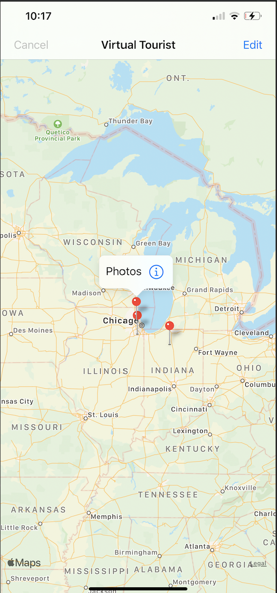
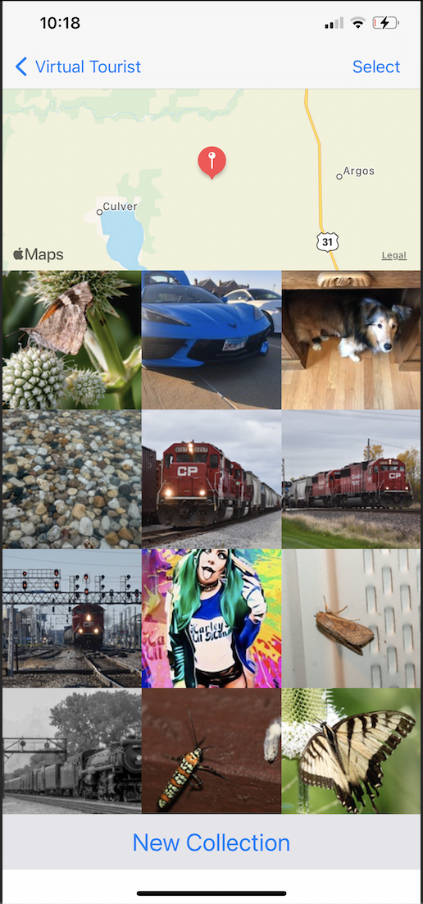

# VirtualTouristSubmited

Virtual Tourist is a project completed as part of Udacity iOS Developer Nanodegree to practice:

- Persisting data using Core Data framework.
- Collectionv view implementation .
- Api request

## Note: 
### For run app, please use your Flickr API and Secret number. ( API from the project it's no more valid).

## Aditional learning:

- Custom MKAnnotationView
- Built views for droping pin on the map view, edit/delete in the photo collection view.

## Fumctionality

Drop a pin

- Press and hold to begin placing a pin on the map.

View location photo

- Once a pin is dropped, or an existing pin is selected , photos for that location are retreived and displayed in a collection view
- If the loction have been view before, photos wil be fetched from Core Data.
- If it's new location photos are downloaded from flickr API.
- Photos can be removed from collection view and Core Data

## Images

